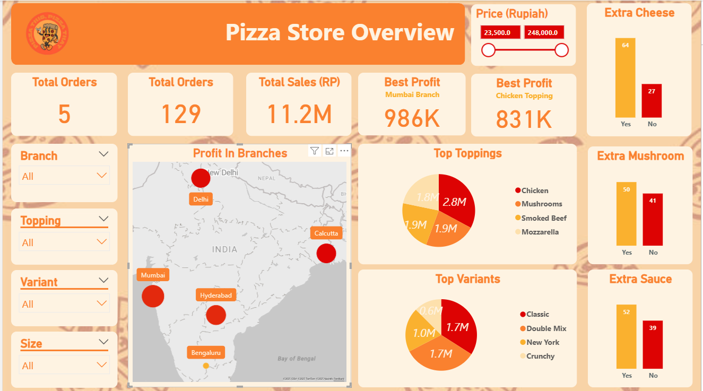
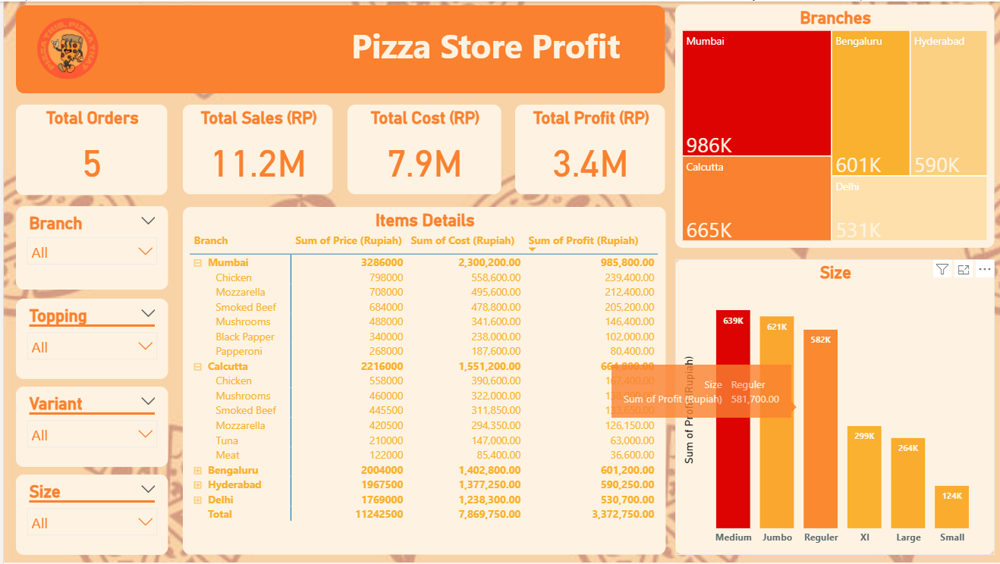

# 🍕 Pizza Store Sales Dashboard

A data analysis and visualization project for an Indian pizza store chain, exploring sales performance, profit margins, and costs across branches — broken down by toppings, size, variants, and more.

---

## 📊 Dashboard Preview

| Overview Page | Profit Page |
|---|---|
|  |  |

---

## 📁 Project Files

| File | Description |
|---|---|
| `pizzaStore.pbix` | Main Power BI dashboard file |
| `pizaaCode.py` | Python script for data cleaning & preprocessing |
| `pizza.csv` | Original raw dataset |
| `pizza_mod.csv` | Cleaned/modified dataset used in the dashboard |
| `pizzaTheme.json` | Custom pizza-themed Power BI color theme |
| `Overview.png` | Screenshot – Overview page |
| `Profit.png` | Screenshot – Profit analysis page |
| `pizza_bg.jpg` | Background image used in the dashboard |

---

## 📌 Key Insights Covered

- 💰 **Sales & Revenue** – Total sales performance across all branches
- 📈 **Profit & Cost Analysis** – Profit margins and cost breakdown per branch
- 🍕 **Product Breakdown** – Performance by pizza size, variant, and toppings
- 🏪 **Branch Comparison** – Side-by-side performance of different store locations

---

## 🛠️ Tools & Technologies

| Tool | Purpose |
|---|---|
| **Python (Pandas)** | Data cleaning & preprocessing |
| **Power BI** | Interactive dashboard & visualization |
| **Power Query** | Data transformation inside Power BI |
| **CSV** | Raw and processed data storage |

---

## 🔄 Workflow

```
Raw Data (pizza.csv)
       ↓
Python Script (pizaaCode.py)  ← Data Cleaning & Feature Engineering
       ↓
Clean Data (pizza_mod.csv)
       ↓
Power BI (pizzaStore.pbix)    ← Visualization & Dashboard
```

---

## 🚀 How to Use

### View the Dashboard
1. Download `pizzaStore.pbix`
2. Open it with [Power BI Desktop](https://powerbi.microsoft.com/desktop/) (free)
3. Explore the interactive Overview and Profit pages

### Run the Python Script
1. Make sure you have Python installed with **Pandas**:
   ```bash
   pip install pandas
   ```
2. Place `pizza.csv` in the same folder as `pizaaCode.py`
3. Run the script:
   ```bash
   python pizaaCode.py
   ```
4. The script will generate `pizza_mod.csv` — the cleaned dataset used by the dashboard

---

## 📂 Data Source

The dataset covers sales records from an Indian pizza store chain, including fields such as branch location, pizza size, variant, toppings, quantity sold, revenue, and cost.

---

## 👤 Author

**Mohammed Al-Faraj**
[GitHub Profile](https://github.com/mo-f-alfaraj)
